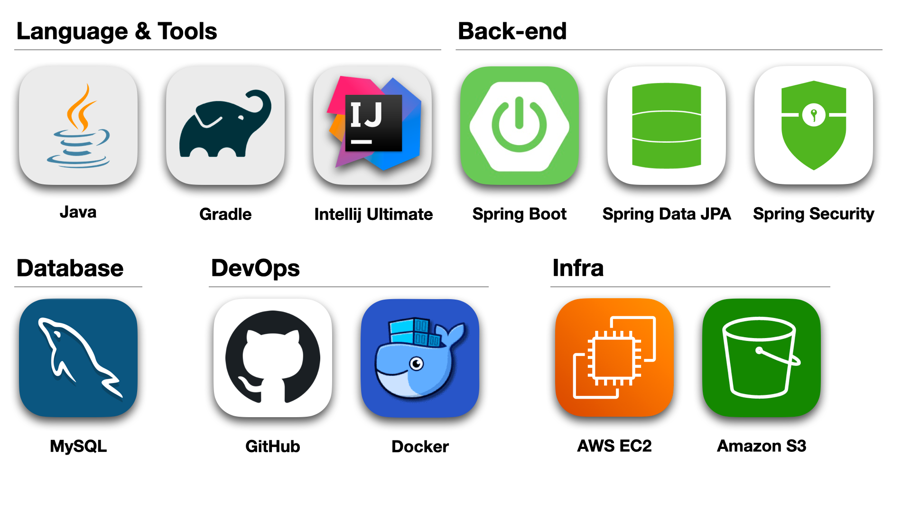

# Hello, I'm Seohyeon 👋🏻

 

## 🍀 Introduction
#### 끊임없이 학습하며 활발히 소통하는 주니어 백엔드 개발자 장서현입니다.
- [이력서](https://www.notion.so/119cc3aa525643fba3600bd9027bbefe?pvs=4)

## 🎒 Education
#### 멋쟁이사자처럼 백엔드 스쿨 2기 (2022.09 ~ 2023.02 )

##  Project
#### [📱 MutsaSNS(멋사스네스)](https://gitlab.com/Senna97/mutsasns/-/blob/main/README.md) (2022.12 ~ 2023.01)
- 회원가입, 로그인, 포스트 및 댓글 CRUD, 마이피드, 좋아요, 알림 기능이 있는 SNS 서비스
#### [📚 BookMore[북: 모아]](https://github.com/likelion-backend-2nd-project-team11/book-more/blob/main/README.md) (2023.01 ~ 2023.02)
- SNS 스타일의 도서 리뷰 공유 플랫폼으로, 팔로잉/팔로워 기능, 랭킹 기능, 시각적인 효과의 리뷰가 중점적인 서비스

 

## 💪🏻 Skills
